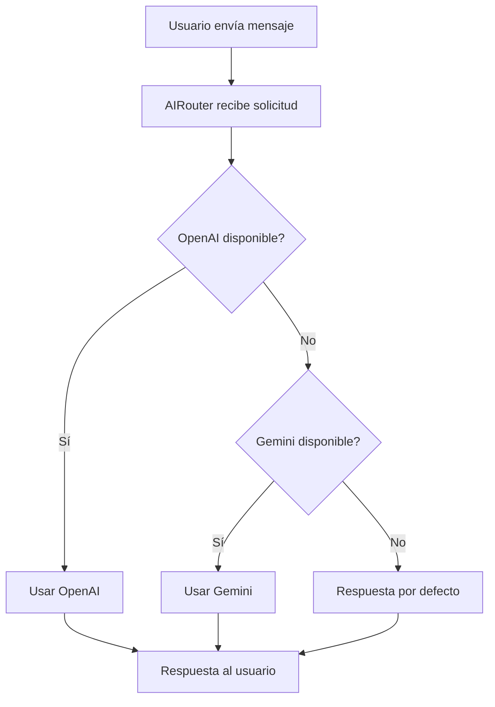

# Sistema de IA con Fallback - Conecta2 WhatsApp Bot

## Descripción General

El sistema de IA del bot de WhatsApp de Conecta2 ha sido mejorado con un sistema de fallback robusto que garantiza respuestas inteligentes incluso cuando el servicio principal de IA no está disponible.

## Arquitectura del Sistema

### Componentes Principales

1. **AIRouter**: Gestor principal que coordina entre servicios de IA
2. **OpenAIService**: Servicio principal usando OpenAI GPT-3.5-turbo
3. **GeminiService**: Servicio de respaldo usando Google Gemini Pro
4. **AIService**: Interfaz unificada para el resto de la aplicación

### Flujo de Funcionamiento



## Configuración

### Variables de Entorno

```env
# AI APIs
OPENAI_API_KEY=tu_clave_openai
GEMINI_API_KEY=tu_clave_gemini
AI_PRIMARY_SERVICE=openai
AI_FALLBACK_SERVICE=gemini
```

### Servicios Soportados

- **openai**: OpenAI GPT-3.5-turbo
- **gemini**: Google Gemini Pro

## Características del Sistema

### 1. Detección Automática de Disponibilidad

Cada servicio implementa un método `isAvailable()` que:
- Verifica la presencia de la clave API
- Realiza una prueba de conectividad
- Maneja timeouts y errores de red

### 2. Fallback Inteligente

- **Servicio Principal**: Configurado en `AI_PRIMARY_SERVICE`
- **Servicio de Respaldo**: Configurado en `AI_FALLBACK_SERVICE`
- **Respuestas por Defecto**: Si ambos servicios fallan

### 3. Manejo de Errores Específicos

#### OpenAI
- Error 401: Clave API inválida
- Error 429: Límite de uso alcanzado
- Timeout: Problemas de conectividad

#### Gemini
- API_KEY_INVALID: Clave API inválida
- QUOTA_EXCEEDED: Límite de uso alcanzado
- SAFETY: Contenido bloqueado por filtros

### 4. Respuestas por Defecto

Cuando ambos servicios fallan, el sistema proporciona respuestas predefinidas que:
- Mantienen la experiencia del usuario
- Sugieren opciones alternativas (menú, agente)
- Son seleccionadas aleatoriamente para variedad

## Monitoreo y Diagnóstico

### Health Check Endpoint

```http
GET /health
```

**Respuesta:**
```json
{
  "status": "active",
  "service": "Conecta2 WhatsApp Bot",
  "timestamp": "2023-12-07T10:30:00.000Z",
  "ai": {
    "configuration": {
      "primary": "openai",
      "fallback": "gemini",
      "available": ["openai", "gemini"]
    },
    "services": {
      "openai": true,
      "gemini": false
    }
  }
}
```

### Logs del Sistema

El sistema registra automáticamente:
- ✅ Respuestas exitosas con el servicio utilizado
- ⚠️ Fallos del servicio principal
- ❌ Fallos del servicio de respaldo
- 🔄 Uso de respuestas por defecto

## Implementación Técnica

### Interfaz IAIService

```typescript
interface IAIService {
    name: string;
    isAvailable(): Promise<boolean>;
    generateResponse(message: string, user: User): Promise<AIResponse>;
}
```

### Respuesta Estándar

```typescript
interface AIResponse {
    success: boolean;
    message: string;
    service: string;
    error?: string;
}
```

## Configuración de Servicios

### OpenAI

- **Modelo**: gpt-3.5-turbo
- **Tokens máximos**: 150
- **Temperatura**: 0.7
- **Timeout**: 10 segundos

### Gemini

- **Modelo**: gemini-pro
- **Tokens máximos**: 150
- **Temperatura**: 0.7
- **Timeout**: 10 segundos

## Mejores Prácticas

### 1. Configuración de Producción

- Configura ambas claves API para máxima disponibilidad
- Monitorea los límites de uso de cada servicio
- Revisa logs regularmente para detectar patrones de fallo

### 2. Manejo de Costos

- OpenAI: Pago por token utilizado
- Gemini: Límites gratuitos disponibles
- Considera rotar el servicio principal según costos

### 3. Optimización de Prompts

Ambos servicios usan el mismo prompt optimizado para:
- Respuestas en español
- Máximo 200 caracteres
- Tono profesional pero cercano
- Sugerencias de escalación cuando sea necesario

## Troubleshooting

### Problema: Ambos servicios fallan constantemente

**Posibles causas:**
- Claves API inválidas o expiradas
- Límites de cuota alcanzados
- Problemas de conectividad

**Solución:**
1. Verificar claves API en el panel de cada proveedor
2. Revisar límites de uso y facturación
3. Probar conectividad desde el servidor

### Problema: Respuestas de baja calidad

**Posibles causas:**
- Prompt no optimizado para el servicio de respaldo
- Configuración de temperatura muy alta/baja

**Solución:**
1. Ajustar prompts específicos por servicio
2. Modificar parámetros de generación
3. Implementar filtros de calidad

### Problema: Latencia alta

**Posibles causas:**
- Timeouts muy largos
- Servicios lentos

**Solución:**
1. Reducir timeouts de conexión
2. Implementar cache de respuestas frecuentes
3. Optimizar prompts para respuestas más cortas

## Extensibilidad

### Agregar Nuevo Servicio de IA

1. Crear clase que implemente `IAIService`
2. Registrar en `AIRouter`
3. Actualizar configuración
4. Agregar tests correspondientes

### Ejemplo: Claude AI

```typescript
export class ClaudeService implements IAIService {
    public readonly name = 'Claude';
    
    async isAvailable(): Promise<boolean> {
        // Implementar verificación
    }
    
    async generateResponse(message: string, user: User): Promise<AIResponse> {
        // Implementar generación
    }
}
```

## Métricas Recomendadas

- Tasa de éxito por servicio
- Tiempo de respuesta promedio
- Uso de fallback vs servicio principal
- Satisfacción del usuario con respuestas IA
- Costos por servicio

---

© 2023 Conecta2 Telecomunicaciones SAS. Todos los derechos reservados.