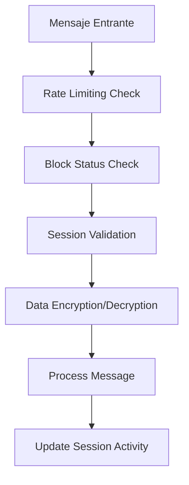

# Características de Seguridad y Autenticación - Conecta2 WhatsApp Bot

## Descripción General

El bot de WhatsApp de Conecta2 ha sido mejorado con un sistema de seguridad robusto que incluye múltiples capas de protección para garantizar la seguridad de los datos de los usuarios y prevenir ataques maliciosos.

## Características de Seguridad Implementadas

### 1. 🔒 **Bloqueo Temporal por Intentos Fallidos**

#### Funcionamiento:
- **Límite de intentos**: 3 intentos fallidos de autenticación
- **Duración del bloqueo**: 15 minutos
- **Seguimiento automático**: El sistema registra cada intento de autenticación
- **Limpieza automática**: Los bloqueos expirados se eliminan automáticamente

#### Mensajes al Usuario:
```
🔒 Demasiados intentos fallidos de autenticación.

Tu cuenta ha sido bloqueada temporalmente por 15 minutos por seguridad.

Si necesitas ayuda inmediata, contacta a nuestro equipo de soporte.
```

#### Configuración:
```env
MAX_AUTH_ATTEMPTS=3
BLOCK_DURATION_MINUTES=15
```

### 2. 🔐 **Encriptación End-to-End de Datos Sensibles**

#### Datos Encriptados:
- Información del cliente (ID, nombre)
- Datos de sesión sensibles
- Información personal identificable

#### Algoritmo:
- **Cifrado**: AES-256-CBC
- **Clave**: Configurable en variables de entorno
- **Implementación**: Automática en tiempo real

#### Configuración:
```env
ENCRYPTION_KEY=your-32-character-encryption-key-here-change-in-production
```

#### Ejemplo de Uso:
```typescript
// Encriptar datos sensibles
const encryptedData = securityService.encryptSensitiveData(JSON.stringify({
    customerId: customerData.id,
    customerName: customerData.name
}));

// Desencriptar cuando sea necesario
const decryptedData = securityService.decryptSensitiveData(encryptedData);
```

### 3. ⚡ **Rate Limiting para Prevenir Spam/Ataques**

#### Límites Configurados:
- **Ventana de tiempo**: 1 minuto
- **Máximo de mensajes**: 10 por minuto por usuario
- **Reseteo automático**: Al finalizar la ventana de tiempo

#### Mensaje de Rate Limiting:
```
⚠️ Has enviado demasiados mensajes muy rápido.

Por favor espera 1 minuto(s) antes de enviar otro mensaje.

Esta medida nos ayuda a mantener un servicio de calidad para todos nuestros usuarios.
```

#### Configuración:
```env
RATE_LIMIT_MAX_REQUESTS=10
RATE_LIMIT_WINDOW_MINUTES=1
```

### 4. ⏰ **Gestión de Sesiones con Expiración Automática**

#### Características de Sesión:
- **Duración**: 2 horas por defecto
- **Extensión automática**: Con cada mensaje del usuario
- **Expiración automática**: Por seguridad
- **ID único**: Generado criptográficamente

#### Flujo de Sesión:
1. **Creación**: Al autenticarse exitosamente
2. **Validación**: En cada mensaje
3. **Extensión**: Automática con actividad
4. **Expiración**: Después de 2 horas de inactividad

#### Comandos de Sesión:
- `sesion` - Ver información de la sesión actual
- `extender_sesion` - Renovar sesión manualmente

#### Configuración:
```env
SESSION_DURATION_HOURS=2
```

## Arquitectura de Seguridad

### Componentes Principales



### SecurityService - Componente Central

```typescript
class SecurityService {
    // Gestión de intentos de autenticación
    recordAuthAttempt(phoneNumber: string, success: boolean): boolean
    isUserBlocked(phoneNumber: string): { blocked: boolean; remainingTime?: number }
    getRemainingAuthAttempts(phoneNumber: string): number
    
    // Rate limiting
    checkRateLimit(phoneNumber: string): { allowed: boolean; remainingRequests?: number }
    
    // Gestión de sesiones
    createSession(phoneNumber: string): string
    validateSession(phoneNumber: string): { valid: boolean; remainingTime?: number }
    extendSession(phoneNumber: string): boolean
    invalidateSession(phoneNumber: string): void
    
    // Encriptación
    encryptSensitiveData(data: string): string
    decryptSensitiveData(encryptedData: string): string
    
    // Monitoreo
    getSecurityStats(): SecurityStats
}
```

## Flujos de Seguridad Detallados

### 1. Flujo de Autenticación Segura

```
Usuario envía documento
↓
Verificar rate limiting
↓
Verificar si está bloqueado
↓
Intentar autenticación con WispHub
↓
Si exitoso:
  - Registrar intento exitoso
  - Crear sesión segura
  - Encriptar datos del cliente
  - Enviar confirmación
↓
Si fallido:
  - Registrar intento fallido
  - Verificar si debe bloquear
  - Mostrar intentos restantes
  - Enviar mensaje apropiado
```

### 2. Flujo de Validación de Sesión

```
Usuario envía mensaje
↓
Verificar rate limiting
↓
Verificar bloqueo
↓
Validar sesión activa
↓
Si sesión válida:
  - Actualizar última actividad
  - Procesar mensaje
  - Verificar tiempo restante
  - Enviar recordatorio si es necesario
↓
Si sesión inválida:
  - Invalidar usuario
  - Solicitar re-autenticación
  - Limpiar datos de sesión
```

### 3. Flujo de Rate Limiting

```
Mensaje entrante
↓
Verificar ventana de tiempo actual
↓
Si ventana expirada:
  - Resetear contador
  - Permitir mensaje
↓
Si dentro de límites:
  - Incrementar contador
  - Permitir mensaje
↓
Si excede límites:
  - Bloquear mensaje
  - Enviar mensaje de espera
  - Calcular tiempo de reseteo
```

## Monitoreo y Métricas

### Endpoint de Salud Mejorado

```http
GET /health
```

**Respuesta con Métricas de Seguridad:**
```json
{
  "status": "active",
  "service": "Conecta2 WhatsApp Bot",
  "timestamp": "2023-12-07T10:30:00.000Z",
  "ai": {
    "configuration": {...},
    "services": {...}
  },
  "security": {
    "blockedUsers": 2,
    "activeSessions": 15,
    "rateLimitedUsers": 1,
    "totalAuthAttempts": 45
  }
}
```

### Logs de Seguridad

El sistema registra automáticamente:
- ✅ Autenticaciones exitosas
- ❌ Intentos de autenticación fallidos
- 🔒 Bloqueos de usuarios
- ⚡ Violaciones de rate limiting
- 🔄 Creación y expiración de sesiones
- 🧹 Limpieza automática de datos

## Comandos de Usuario para Gestión de Sesión

### `sesion` - Información de Sesión
```
🔒 Información de Sesión

👤 Usuario: Juan Pérez
📱 Teléfono: +57123456789
⏰ Tiempo restante: 1 hora(s) y 45 minuto(s)
🔐 Sesión ID: a1b2c3d4...
📅 Última actividad: 07/12/2023 14:30

💡 Tu sesión se extiende automáticamente con cada mensaje.
Escribe "extender_sesion" para renovar manualmente.
```

### `extender_sesion` - Renovar Sesión
```
✅ Sesión Extendida

⏰ Tu sesión ha sido renovada por 2 horas adicionales.

🔒 Continuarás autenticado de forma segura.

Escribe "sesion" para ver los detalles actualizados.
```

## Configuración de Producción

### Variables de Entorno Recomendadas

```env
# Security Configuration
ENCRYPTION_KEY=generate-a-strong-32-character-key-for-production
MAX_AUTH_ATTEMPTS=3
BLOCK_DURATION_MINUTES=15
RATE_LIMIT_MAX_REQUESTS=10
RATE_LIMIT_WINDOW_MINUTES=1
SESSION_DURATION_HOURS=2
```

### Generación de Clave de Encriptación Segura

```bash
# Generar clave aleatoria de 32 caracteres
openssl rand -hex 16

# O usando Node.js
node -e "console.log(require('crypto').randomBytes(16).toString('hex'))"
```

## Mejores Prácticas de Seguridad

### 1. Gestión de Claves
- ✅ Usar claves de encriptación únicas por entorno
- ✅ Rotar claves periódicamente
- ✅ Almacenar claves en gestores de secretos
- ❌ No hardcodear claves en el código

### 2. Monitoreo Continuo
- ✅ Revisar logs de seguridad regularmente
- ✅ Configurar alertas para patrones sospechosos
- ✅ Monitorear métricas de autenticación
- ✅ Implementar dashboards de seguridad

### 3. Configuración de Rate Limiting
- ✅ Ajustar límites según el uso real
- ✅ Implementar diferentes límites por tipo de usuario
- ✅ Considerar picos de tráfico legítimos
- ✅ Documentar excepciones y whitelist

### 4. Gestión de Sesiones
- ✅ Configurar duración apropiada para el caso de uso
- ✅ Implementar logout manual si es necesario
- ✅ Limpiar sesiones expiradas regularmente
- ✅ Notificar a usuarios sobre expiración próxima

## Cumplimiento y Regulaciones

### Protección de Datos (Ley 1581 de 2012)
- ✅ Encriptación de datos personales
- ✅ Consentimiento explícito para tratamiento
- ✅ Derecho al olvido (eliminación de datos)
- ✅ Transparencia en el manejo de datos

### Seguridad de la Información
- ✅ Autenticación robusta
- ✅ Control de acceso basado en sesiones
- ✅ Auditoría de accesos y actividades
- ✅ Protección contra ataques automatizados

## Troubleshooting de Seguridad

### Usuario Bloqueado Incorrectamente
```bash
# Verificar logs de autenticación
grep "blocked" logs/security.log

# Revisar intentos de autenticación
curl http://localhost:3000/health | jq '.security'
```

### Problemas de Rate Limiting
```bash
# Verificar configuración actual
echo $RATE_LIMIT_MAX_REQUESTS
echo $RATE_LIMIT_WINDOW_MINUTES

# Ajustar límites si es necesario
export RATE_LIMIT_MAX_REQUESTS=15
```

### Sesiones que Expiran Muy Rápido
```bash
# Verificar duración configurada
echo $SESSION_DURATION_HOURS

# Extender duración si es apropiado
export SESSION_DURATION_HOURS=4
```

## Roadmap de Seguridad

### Próximas Mejoras
1. **Autenticación Multifactor (2FA)**
   - SMS con código de verificación
   - Integración con apps de autenticación

2. **Detección de Anomalías**
   - Patrones de uso sospechosos
   - Geolocalización de accesos

3. **Auditoría Avanzada**
   - Logs estructurados
   - Integración con SIEM

4. **Backup y Recuperación**
   - Respaldo de datos de sesión
   - Recuperación ante desastres

---

© 2023 Conecta2 Telecomunicaciones SAS. Todos los derechos reservados.