# 📋 DOCUMENTACIÓN DE ENDPOINTS PARA INTEGRACIÓN CRM

## 🎯 **RESUMEN EJECUTIVO**

Este documento detalla los endpoints necesarios para integrar el Bot WhatsApp con un sistema CRM externo, permitiendo handovers bidireccionales entre bot y agentes humanos.

## 🔄 **FLUJO DE HANDOVER IMPLEMENTADO**

### **1. Bot → Agente Humano**
1. Usuario solicita hablar con agente
2. Bot crea ticket de handover
3. Bot notifica al CRM
4. CRM asigna agente
5. Control se transfiere al agente

### **2. Agente Humano → Bot**
1. Agente completa atención
2. CRM notifica finalización
3. Control regresa al bot
4. Bot muestra menú principal

---

## 🚀 **ENDPOINTS DEL BOT (Recibir desde CRM)**

### **1. Notificación de Handover**
```http
POST /api/crm/handover
Content-Type: application/json
Authorization: Bearer <CRM_API_TOKEN>
```

**Request Body:**
```json
{
  "ticketId": "TK-2025-001234",
  "userPhone": "573001234567",
  "agentId": "agent_001",
  "agentName": "María González",
  "handoverType": "bot_to_human" | "human_to_bot",
  "metadata": {
    "serviceSuspended": true,
    "priority": "alta",
    "category": "reactivacion_servicio"
  }
}
```

**Response:**
```json
{
  "success": true,
  "message": "Handover processed successfully",
  "ticketId": "TK-2025-001234"
}
```

**Códigos de Error:**
- `400`: Campos requeridos faltantes
- `404`: Ticket no encontrado
- `500`: Error interno del servidor

---

### **2. Envío de Mensajes desde Agente**
```http
POST /api/crm/send-message
Content-Type: application/json
Authorization: Bearer <CRM_API_TOKEN>
```

**Request Body:**
```json
{
  "ticketId": "TK-2025-001234",
  "userPhone": "573001234567",
  "agentId": "agent_001",
  "message": "Hola, soy María y te ayudaré con la reactivación de tu servicio.",
  "messageType": "text" | "image" | "document",
  "timestamp": "2025-06-06T15:30:00.000Z"
}
```

**Response:**
```json
{
  "success": true,
  "message": "Message sent successfully",
  "ticketId": "TK-2025-001234"
}
```

---

### **3. Estado de Handover**
```http
GET /api/crm/handover-status/{ticketId}
Authorization: Bearer <CRM_API_TOKEN>
```

**Response:**
```json
{
  "ticketId": "TK-2025-001234",
  "status": "active" | "closed" | "pending",
  "assignedAgent": {
    "id": "agent_001",
    "name": "María González"
  },
  "startTime": "2025-06-06T15:25:00.000Z",
  "lastActivity": "2025-06-06T15:30:00.000Z",
  "messageCount": 5
}
```

---

### **4. Webhook Meta Handover**
```http
POST /api/crm/meta-handover-webhook
Content-Type: application/json
X-Hub-Signature-256: <signature>
```

**Request Body (Meta):**
```json
{
  "object": "whatsapp_business_account",
  "entry": [
    {
      "id": "WHATSAPP_BUSINESS_ACCOUNT_ID",
      "changes": [
        {
          "value": {
            "messaging_product": "whatsapp",
            "metadata": {
              "display_phone_number": "573001234567",
              "phone_number_id": "PHONE_NUMBER_ID"
            },
            "event": "pass_thread_control",
            "thread_control": {
              "app_id": "CRM_APP_ID",
              "metadata": "{\"ticket_id\":\"TK-2025-001234\"}"
            }
          },
          "field": "messaging_handovers"
        }
      ]
    }
  ]
}
```

---

## 📤 **ENDPOINTS QUE EL CRM DEBE IMPLEMENTAR**

### **1. Notificación de Agente Requerido**
```http
POST {CRM_BASE_URL}/api/bot/agent-request
Content-Type: application/json
Authorization: Bearer <BOT_API_TOKEN>
```

**Request Body:**
```json
{
  "ticketId": "TK-2025-001234",
  "userPhone": "573001234567",
  "userContext": {
    "phoneNumber": "573001234567",
    "customerId": "12345",
    "customerName": "Juan Pérez",
    "isAuthenticated": true,
    "lastActivity": "2025-06-06T15:25:00.000Z",
    "sessionInfo": {
      "hasActiveSession": true,
      "sessionStart": "2025-06-06T15:20:00.000Z"
    }
  },
  "priority": "alta" | "media" | "baja",
  "category": "reactivacion_servicio" | "soporte_agente",
  "serviceSuspended": true,
  "requestTime": "2025-06-06T15:25:00.000Z"
}
```

**Response Esperada:**
```json
{
  "success": true,
  "agentAssigned": {
    "id": "agent_001",
    "name": "María González",
    "estimatedResponseTime": "5-10 minutes"
  },
  "ticketId": "TK-2025-001234"
}
```

---

## 🔑 **CONFIGURACIÓN DE AUTENTICACIÓN**

### **Variables de Entorno Requeridas:**

```env
# CRM Integration
CRM_BASE_URL=https://crm.conecta2tel.com
CRM_API_TOKEN=your_crm_api_token_here
CRM_AGENT_NOTIFICATION_URL=${CRM_BASE_URL}/api/bot/agent-request

# Meta Handover
CRM_META_APP_ID=your_crm_meta_app_id
META_HANDOVER_WEBHOOK_URL=https://bot.conecta2tel.com/api/crm/meta-handover-webhook

# Bot Authentication
BOT_API_TOKEN=your_bot_api_token_here
WEBHOOK_VERIFY_TOKEN=your_webhook_verify_token
```

---

## 📊 **FLUJOS DE DATOS**

### **Flujo Completo de Handover para Servicio Suspendido:**

```mermaid
sequenceDiagram
    participant U as Usuario
    participant B as Bot
    participant C as CRM
    participant A as Agente

    U->>B: "Contactar Soporte"
    B->>B: Verificar servicio suspendido
    B->>B: Crear ticket reactivación
    B->>C: POST /api/bot/agent-request
    B->>U: "Conectando con agente especializado..."
    
    C->>C: Asignar agente reactivación
    C->>B: POST /api/crm/handover
    B->>U: "Agente María conectado"
    
    A->>C: Escribe respuesta
    C->>B: POST /api/crm/send-message
    B->>U: Mensaje del agente
    
    A->>C: Resuelve reactivación
    C->>B: POST /api/crm/handover (human_to_bot)
    B->>U: "Consulta resuelta, regresando al menú"
```



---

## 🎯 **CASOS DE USO ESPECÍFICOS**

### **1. Usuario con Servicio Suspendido**
- **Trigger:** Usuario autenticado con `isInactive: true`
- **Acción:** Crear ticket categoría `reactivacion_servicio`
- **Prioridad:** `alta`
- **Agente:** Especializado en reactivaciones

### **2. Usuario Activo Necesita Soporte**
- **Trigger:** Usuario solicita agente humano
- **Acción:** Crear ticket categoría `soporte_agente`
- **Prioridad:** `media`
- **Agente:** Soporte general

### **3. Usuario No Autenticado**
- **Trigger:** Usuario sin autenticar solicita agente
- **Acción:** Solicitar autenticación primero
- **Fallback:** Número de emergencia 3242156679

---

## 🛡️ **SEGURIDAD Y VALIDACIÓN**

### **Headers de Seguridad Requeridos:**
```http
Authorization: Bearer <API_TOKEN>
Content-Type: application/json
X-Bot-Signature: <request_signature>
User-Agent: Conecta2Tel-Bot/1.0
```

### **Validación de Webhooks Meta:**
```javascript
// Verificar signature de Meta
const signature = req.headers['x-hub-signature-256'];
const payload = JSON.stringify(req.body);
const expectedSignature = crypto
  .createHmac('sha256', process.env.META_WEBHOOK_SECRET)
  .update(payload)
  .digest('hex');
```

---

## 📈 **MÉTRICAS Y MONITOREO**

### **KPIs a Trackear:**
- Tiempo de respuesta del agente
- Tasa de resolución de tickets
- Satisfacción del cliente post-handover
- Tiempo promedio de handover
- Tickets de reactivación vs soporte general

### **Logs Importantes:**
```javascript
console.log(`🔔 AGENTE REQUERIDO: ${userPhone} - Ticket: ${ticketId}`);
console.log(`✅ Handover completado: Bot→Humano - ${ticketId}`);
console.log(`🔄 Control regresado: Humano→Bot - ${ticketId}`);
```

---

## 🔧 **IMPLEMENTACIÓN EN DESARROLLO**

### **Configurar Webhook URL en Meta:**
```
https://bot.conecta2tel.com/webhook
```

### **Configurar CRM Endpoints:**
```
https://bot.conecta2tel.com/api/crm/handover
https://bot.conecta2tel.com/api/crm/send-message
https://bot.conecta2tel.com/api/crm/handover-status/{ticketId}
https://bot.conecta2tel.com/api/crm/meta-handover-webhook
```

---

## ⚠️ **CONSIDERACIONES IMPORTANTES**

1. **Timeouts:** Implementar timeouts para handovers que no reciben respuesta
2. **Fallbacks:** Tener números de emergencia como backup
3. **Escalación:** Procedimiento si no hay agentes disponibles
4. **Historial:** Mantener log completo de conversaciones
5. **Reintento:** Lógica de reintento para llamadas API fallidas

---

**Versión:** 1.0  
**Fecha:** 6 de Junio, 2025  
**Autor:** Bot-Meta-AI Team  
**Próxima Revisión:** Cuando se implemente el CRM
